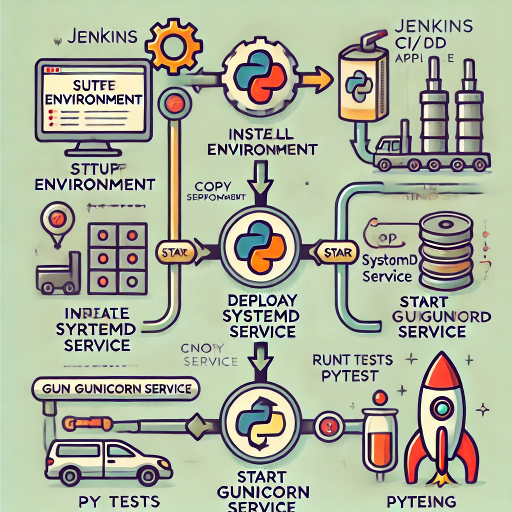
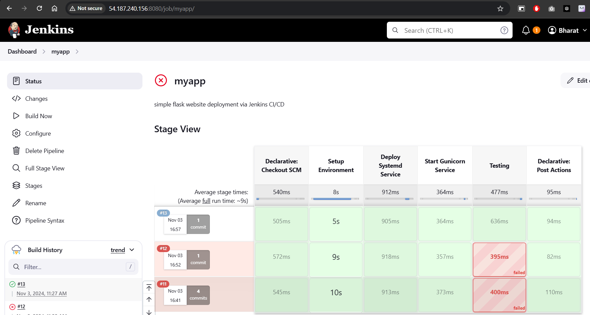
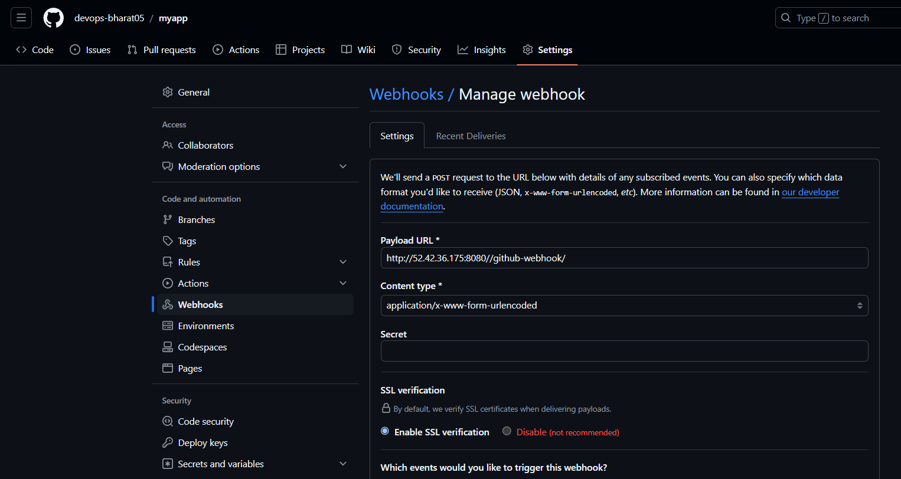
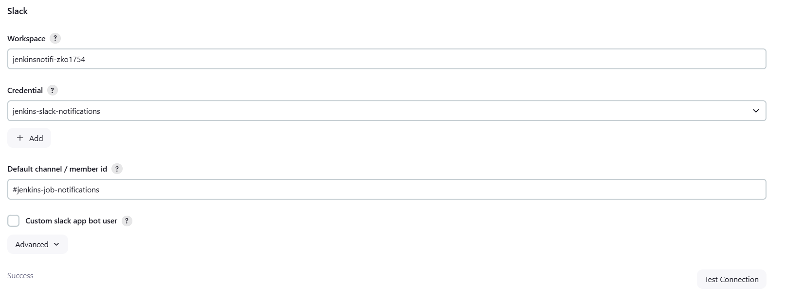
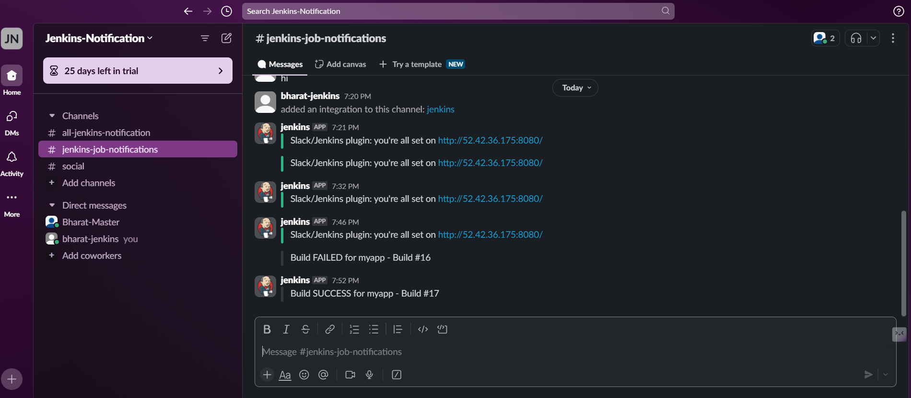
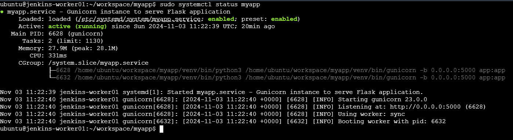
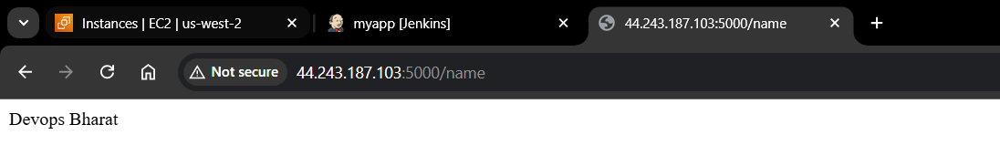
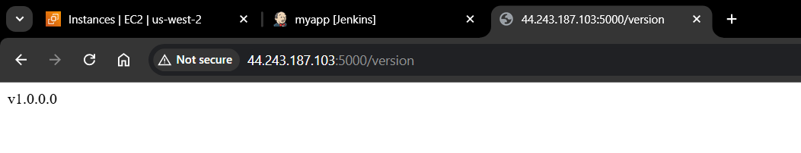

# 🚀 Jenkins CI/CD Pipeline for Flask Application 🚀

This repository demonstrates a CI/CD pipeline using Jenkins to deploy a Flask application. The setup automates environment setup, deployment, and testing of the Flask application on a Linux server using `systemd` and `gunicorn`. 

  <!-- Replace with actual image link -->

## Project Structure 📁

| File              | Description                                                       |
|-------------------|-------------------------------------------------------------------|
| **Jenkinsfile**   | Pipeline script defining CI/CD stages.                            |
| **app.py**        | Flask application with endpoints to display application information. |
| **myapp.service** | Systemd service file for running the Flask app with gunicorn.     |
| **tests.py**      | Test script for verifying Flask endpoints.                        |

## Pipeline Overview 🛠️

The Jenkins pipeline automates the following steps:
1. **Setup Environment**: Installs Python dependencies, sets up a virtual environment, and installs necessary packages.
2. **Deploy Systemd Service**: Copies the `myapp.service` file to the systemd directory and enables the service.
3. **Start Gunicorn Service**: Starts the Flask application service.
4. **Testing**: Runs automated tests on the Flask application using `pytest`.
5. **Triggers**: Configured to automatically trigger a new build on code changes.
6. **Notifications**: Sends notifications to Slack upon build success or failure.

 <!-- Replace with actual image link -->

### Requirements ✅

- **Jenkins Worker Node** - Ensure you have a Jenkins node labeled `Jenkins-worker01` with SSH access and `sudo` privileges.
- **Python** - Ensure Python 3.x is installed on the server.
- **Network Access** - The application should be accessible on port `5000`.

## Setup Instructions ⚙️

1. **Prerequisites**:
   - **Jenkins**: Install Jenkins on your server and configure a build node if needed.
   - **Slack Workspace**: Set up a Slack workspace and create a channel for notifications.
   - **GitHub Repository**: Host your code in a GitHub repository to enable webhook triggers.

2. **Install Plugins**:
   - Install the **Slack Notification Plugin** in Jenkins.

3. **Configure Slack**:
   - Go to **Manage Jenkins** > **Configure System** > **Slack**.
   - Enter your **Team Domain** and add a **Credential ID** for the Slack token.
   - Specify the **Default Channel** as `#jenkins-job-notifications`.

4. **Set Up GitHub Webhook**:
   - In your GitHub repository, go to **Settings > Webhooks**.
   - Click **Add webhook** and add your Jenkins URL followed by `/github-webhook/` (e.g., `http://your-jenkins-url/github-webhook/`).
   - Select **Push** events to trigger builds automatically.


## Pipeline Stages in `Jenkinsfile` 📜

```groovy
pipeline {
    agent { label 'Jenkins-worker01' }
    environment {
        APP_DIR = '/home/ubuntu/workspace/myapp'
        SERVICE_FILE = '/etc/systemd/system/myapp.service'
        VENV_PATH = "venv" 
    }

    stages {
        stage('Setup Environment') {
            steps {
                script {
                    try {
                        sh """
                            sudo apt-get update
                            sudo apt install python3-pip -y
                            sudo apt install python3-virtualenv -y
                            cd ${APP_DIR}
                            python3 -m venv $VENV_PATH
                            sudo chown -R ubuntu:ubuntu ${APP_DIR}/venv
                            ./$VENV_PATH/bin/pip install Flask gunicorn pytest requests
                        """
                    } catch (Exception e) {
                        currentBuild.result = 'FAILURE'
                        error("Environment setup failed.")
                    }
                }
            }
        }

        stage('Deploy Systemd Service') {
            steps {
                script {
                    try {
                        sh """
                            sudo cp ${APP_DIR}/myapp.service ${SERVICE_FILE}
                            sudo systemctl daemon-reload
                            sudo systemctl enable myapp
                        """
                    } catch (Exception e) {
                        currentBuild.result = 'FAILURE'
                        error("Deploying systemd service failed.")
                    }
                }
            }
        }

        stage('Start Gunicorn Service') {
            steps {
                script {
                    try {
                        sh """
                            sudo systemctl start myapp && sudo systemctl status myapp || true
                        """
                    } catch (Exception e) {
                        currentBuild.result = 'FAILURE'
                        error("Starting Gunicorn service failed.")
                    }
                }
            }
        }

        stage('Testing') {
            steps {
                script {
                    try {
                        sh """
                            ./$VENV_PATH/bin/pytest tests.py
                        """
                    } catch (Exception e) {
                        currentBuild.result = 'FAILURE'
                        error("Tests failed.")
                    }
                }
            }
        }
    }

    triggers {
        pollSCM('H/5 * * * *')  // Polls every 5 minutes for changes
    }

    post {
        always {
            script {
                if (currentBuild.result == 'SUCCESS') {
                    slackSend(channel: '#jenkins-job-notifications', message: "Build SUCCESS for myapp - Build #${env.BUILD_NUMBER}")
                } else {
                    slackSend(channel: '#jenkins-job-notifications', message: "Build FAILED for myapp - Build #${env.BUILD_NUMBER}")
                }
            }
        }
    }
}

```

### Application Code (app.py) 🐍

This Flask application provides two endpoints:
- **/name** - Returns the name of the developer.
- **/version** - Returns the current version of the application.

```python
from flask import Flask
app = Flask(__name__)

@app.route('/name')
def get_name():
    return 'Devops Bharat'

@app.route('/version')
def get_version():
    return 'v1.0.0.0'

if __name__ == '__main__':
    app.run(host='0.0.0.0', port=5000)
```

### Systemd Service File (myapp.service) 📝

This systemd service file configures the application to run with gunicorn.

```ini
[Unit]
Description=Gunicorn instance to serve Flask application
After=network.target

[Service]
User=ubuntu
Group=www-data
WorkingDirectory=/home/ubuntu/workspace/myapp
Environment="PATH=/home/ubuntu/workspace/myapp/venv/bin"
ExecStart=/home/ubuntu/workspace/myapp/venv/bin/gunicorn -b 0.0.0.0:5000 app:app

[Install]
WantedBy=multi-user.target
```

### Testing (tests.py) ✅

Tests for the application endpoints are defined in `tests.py`. These tests use `pytest` and `requests` to validate endpoint responses.

```python
import requests
import pytest

BASE_URL = "http://localhost:5000"

def test_get_name():
    response = requests.get(BASE_URL + "/name")
    assert response.status_code == 200
    assert response.text == 'Devops Bharat'

def test_get_version():
    response = requests.get(BASE_URL + "/version")
    assert response.status_code == 200
    assert response.text == 'v1.0.0.0'
```

## Running the Pipeline ▶️

1. **Set Up Jenkins Job**: Create a Jenkins job and link it to this repository.
2. **Run the Job**: Run the pipeline job to deploy the Flask application. Jenkins will automatically go through each stage and handle any errors according to the `post` conditions.

## Triggers 🔄

The pipeline is set to automatically trigger on updates to the GitHub repository:

- **GitHub Webhook**: This is configured in GitHub, so Jenkins triggers a new build whenever there’s a push event.

- **Polling SCM**: Additionally, the `pollSCM('H/5 * * * *')` configuration polls for changes every 5 minutes to ensure no updates are missed.

## Notifications 📢

Slack notifications are configured to alert the `#jenkins-job-notifications` channel:

- **Success Message**: Notifies the channel when a build completes successfully.
- **Failure Message**: Alerts the channel if any step in the build process fails.
 


## Monitoring 🖥️

After deployment, monitor the application service with:
```bash
sudo systemctl status myapp
```


Access the application at `http://<your_server_ip>:5000`.


<!-- Replace with actual image link -->

## Troubleshooting 🔧

- **Service Issues**: Check systemd logs for error messages:
    ```bash
    sudo journalctl -u myapp
    ```

- **Network Issues**: Verify the application is accessible on the specified port (5000 by default).

